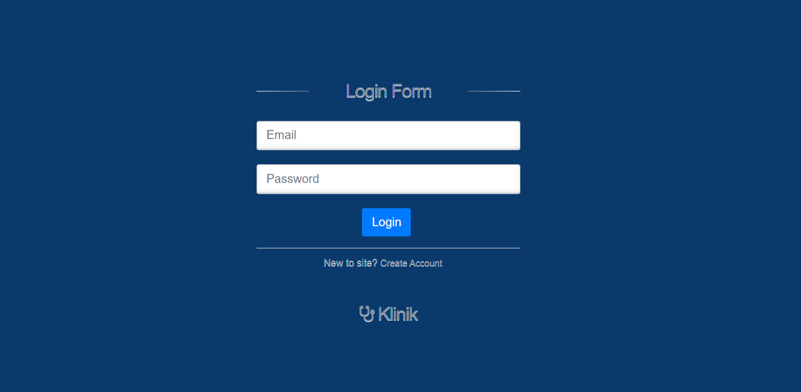

# Project CRUD Klinik Laravel 8

by ridhuwan untuk tes kompetensi


## Features

- CRUD
- MENU LOGIN
- MENU WILAYAH
- MENU TRANSAKSI
- MENU LAPORAN
- MENU INFORMASI PEMBAYARAN

## Badges

Add badges from somewhere like: [shields.io](https://shields.io/)

[](https://choosealicense.com/licenses/mit/)
[](https://opensource.org/licenses/)
[](http://www.gnu.org/licenses/agpl-3.0)


## Deployment

To deploy this project run, download repo project
```bash
  git clone "link repo project pilihan anda"
```

langkah setelah clone repo, buka command lalu ketik
```bash
  copy .env.example .env
```
Untuk pengguna Linux gunakan perintah:
```bash
  cp .env.example .env
```
instal package-package yang diinstal dalam composer
```bash
  composer install
```
Setelah berhasil, buatlah file .env dengan perintah,
```bash
  php artisan key:generate
```
selanjutnya buat file table db dengan perintah,
```bash
php artisan migrate
```
atau bisa dengan secara manual import table database, file tersebut berada pada folder database.

file-file seeder untuk data table yang ada di folder database/seeds
```bash
php artisan db:seed
```
untuk membukanya di web browser, jalankan perintah
```bash
php artisan serve
```


## Screenshots




# Hi, I'm MRidhuwan! 👋


## 🚀 About Me
I'm a full stack developer...
